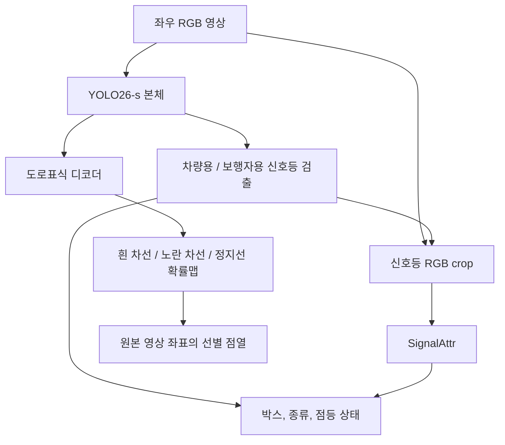

# 모델 구조

2026-09-21 기준 첫 구현이다. 공유 본체에는 YOLO26-s를 사용하고, 신호등 상태는 내부 SignalAttr로 읽는다. 도로표식은 중심선 확률맵을 예측한 뒤 선별 점열로 변환한다. 짧은 GPU 학습과 내보내기를 확인했으며, 본학습은 남아 있다.

## 영상 처리

좌우 영상에는 같은 가중치를 적용하며, 첫 실행안은 batch 2다. 도로표식과 신호등 검출은 본체의 특징을 함께 사용한다. 영상의 종횡비를 유지하고, 800×600 입력에는 여백을 넣어 800×608로 맞춘다.

검출기는 공식 YOLO26 헤드와 E2ELoss를 사용한다. [새 모델](../model/net/pv26.py)은 차량용과 보행자용 두 클래스를 출력하고, 본체와 neck의 사전학습 가중치를 읽는다. 기본 P3/P4/P5 검출의 작은 신호등 재현율을 측정한 뒤 P2 검출 추가를 검토한다.

## SignalAttr

SignalAttr의 모델과 학습 코드는 이미 저장소 안에 있다. Plan B에서 사용하던 가중치를 내부에 복사했고, 같은 분류기를 TorchScript로 내보내는 도구를 추가했다.

| 구성 | 위치 |
| --- | --- |
| 분류 모델과 체크포인트 로드 | [classifier.py](../model/signal_attr/classifier.py) |
| 학습과 재개 | [training.py](../model/signal_attr/training.py) |
| 검출 ID에 연결한 배치 판독 | [runtime.py](../model/signal_attr/runtime.py) |
| 박스 여백과 crop 생성 | [crop.py](../model/signal_attr/crop.py) |
| 데이터 생성과 라벨 변환 | [signal_attr/](../model/signal_attr/) |
| 기존 학습 가중치 | [models/signal_attr](../models/signal_attr/README.md) |
| TorchScript 내보내기 | [signal_attr_torchscript.py](../tools/model_export/signal_attr_torchscript.py) |

검출 박스로 원본 RGB를 잘라 128×128 입력을 만든다. 작은 CNN이 색상 `off/red/yellow/green`과 화살표 여부를 출력한다. 색상과 화살표를 따로 예측하므로 빨강+좌회전 같은 조합을 표현할 수 있다.

이 경로는 신호등 영역에 추가 연산을 집중한다. 원본 해상도가 낮아 불빛이 사라진 경우에는 crop을 확대해도 복원되지 않는다. 검출 누락과 상태 판독 오류는 각각 평가한다.

동봉한 가중치는 이전 라벨로 학습한 모델이다. 새 [라벨 변환](../model/signal_attr/aihub_policy.py)은 보행자 상태를 포함하고 좌회전과 기타 화살표를 구분한다. [제품용 학습](../model/signal_attr/training.py)으로 재학습한 체크포인트를 [내부 추론기](../model/signal_attr/runtime.py)에서 사용한다.

모든 속성이 `off`인 표본의 처리 방식은 crop 생성 시 선택한다. 기타 화살표만 켜진 표본은 좌회전 음성 표적으로 학습한다. crop의 여백, 보간법, 정규화는 학습과 추론에 같은 설정을 적용한다. 검출기의 차량용과 보행자용 박스 모두 내부 SignalAttr로 전달한다.

## 도로표식

| 항목 | 첫 설계안 |
| --- | --- |
| 특징 | P2의 세부 정보와 P3/P4의 문맥 |
| 특징 결합 | 단계적으로 확대하고 합산 |
| 내부 폭 | 64채널의 경량 합성곱 |
| 예측 | 흰 차선, 노란 차선, 정지선의 중심선 확률맵 |
| 맵 크기 | 입력의 1/4, 800×608 입력에서 200×152 |
| 최종 출력 | 원본 영상 좌표의 선별 2D 점열 |

AIHub polyline으로 중심선 표적을 만든다. 선을 그리는 폭은 학습 표적의 폭이며, 실제 도색 폭을 뜻하지 않는다. 점선의 연결 범위는 원본 polyline을 따른다. 학습 입력 변환과 출력 점열의 역변환에는 같은 좌표 관계를 사용한다.

새 [후처리](../model/engine/postprocess.py)는 맵의 국소 최대점을 연결해 선별 점열을 만든다. 차선은 행을 따라, 정지선은 열을 따라 연결하며 여백 영역을 제외한다. 서로 다른 선의 합쳐짐과 끊김은 [점열 평가](../model/engine/geometry_metrics.py)에서 확인한다.

## 코드 배치

`model/data`는 데이터와 표적을 만들고, `model/net`은 공유 본체와 헤드를 정의한다. 손실, 학습, 평가와 점열 생성은 `model/engine`에서 처리한다. SignalAttr는 `model/signal_attr`, 모델 내보내기는 `tools/model_export`에서 관리한다.

학습과 추론은 YOLOPV26의 코드와 가중치로 실행한다. 외부 시스템은 출력된 관측과 모델 파일을 받아 사용한다. 연결 시 필요한 클래스 의미, 객체 ID, 영상 좌표와 출력 형식은 이 저장소에서 정의한다.
