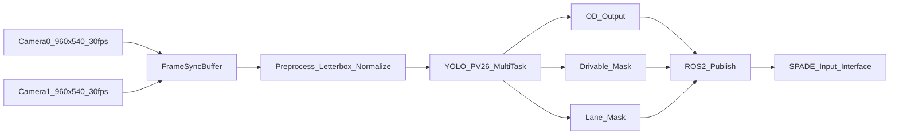
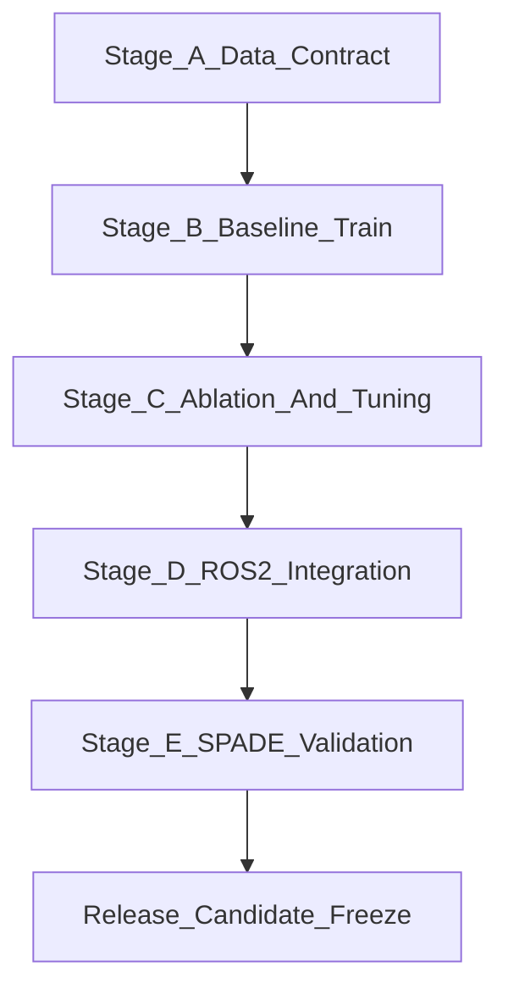

# YOLO PV26 PRD

- 문서 버전: `v0.5`
- 작성일: `2026-02-14`
- 상태: `Draft for implementation`
- 대상 시스템: `SPADE 입력용 멀티태스크 비전 모델`

## 1. 제품 목표

YOLOPv2의 멀티태스크 설계 철학을 따르되, 백본을 YOLO26 계열로 구성한 `YOLO PV26` 모델을 개발한다.  
1차 릴리스(MVP)의 목적은 다음 3개 태스크를 단일 모델로 실시간 처리하는 것이다.

1. 객체 탐지(OD)
2. 주행가능영역 분할(Drivable Area Segmentation)
3. 차선 분할(Lane Segmentation)

본 모델의 출력은 SPADE 파이프라인 입력으로 사용되며, LiDAR 투영/재투영 자체는 본 PRD 범위에서 제외한다.

## 2. 범위 정의

### 2.1 In Scope (MVP)

1. 카메라 2대 입력 실시간 추론
2. OD + Drivable Seg + Lane Seg 동시 출력
3. ROS2 Humble 환경에서 SPADE와 연동 가능한 출력 계약 제공
4. 오프라인 데이터셋 수집/정규화/학습 파이프라인 구축
5. 대회 요구사항 기준 클래스 체계 확정 및 운영

### 2.2 Out of Scope (MVP)

1. LiDAR 투영/역투영 엔진 로직 변경
2. 장애물 픽셀 단위 segmentation (V2 후보)
3. 멀티카메라 3D fusion 로직 신규 개발
4. 서버 배포 전용 아키텍처 최적화

### 2.3 대회 도메인 제약 (MVP 고정)

1. 대회 환경은 실도로가 아닌 모사 주행환경으로 간주한다.
2. 기상 조건은 `건조(dry)`로 고정한다.
3. 시간대 조건은 `주간(day)`로 고정한다.
4. `야간/우천` 성능은 MVP 합격 기준에서 제외한다.
5. `터널 구간`은 포함 범위이며, 명암 급변(출입구 포함) 조건을 검증 범위에 포함한다.

## 3. 운영 환경 및 입력 조건

### 3.1 배포/런타임 고정 조건

1. OS: `Ubuntu 22.04`
2. Middleware: `ROS2 Humble`
3. GPU: `NVIDIA RTX4060 Desktop`
4. 추론 런타임: `PyTorch -> ONNX/TensorRT (단계적 전환 허용)`

### 3.2 카메라 운영 조건 (고정)

1. 카메라 수: `2`
2. 해상도: `960x540` (각 카메라)
3. FPS: `30` (각 카메라)
4. 총 처리 요구량: `60 frames/sec` 입력 처리
5. 카메라 간 동기 허용 오차: `<= 33 ms`

## 4. 시스템 컨텍스트



## 5. 기능 요구사항 (Functional Requirements)

### FR-01. 멀티카메라 입력 처리

1. `cam0`, `cam1` 스트림을 독립적으로 수신하고 추론해야 한다.
2. 각 카메라 입력은 `960x540@30fps`를 기준으로 처리한다.
3. 프레임 메타데이터(`camera_id`, `timestamp_ns`, `frame_seq`)를 유지한다.

### FR-02. 멀티태스크 출력

1. 모델의 학습/논리 출력은 `OD + Drivable(binary) + Lane(binary)` 3개다.
2. 배포용 semantic 출력은 `semantic_id mono8(0/1/2)`로 합성해 제공한다.
3. Drivable/Lane binary는 학습 및 디버깅용 내부 출력이며, ROS2에서는 optional debug 토픽으로 발행할 수 있다.
4. 모든 출력은 입력 프레임과 동일 timestamp를 가져야 한다.

### FR-03. SPADE 연동 계약

1. SPADE가 직접 사용하는 semantic 결과는 `mono8` class-id map 형태로 제공한다.
2. semantic map 기본 ID 계약:
   - `0`: background
   - `1`: drivable_area
   - `2`: lane_marking
3. OD 출력은 별도 토픽으로 발행하고, SPADE core는 semantic 입력만 필수로 사용한다.

### FR-04. 장애물/기물 처리 정책

1. 장애물/기물은 MVP에서 OD로 처리한다.
2. Segmentation 기반 장애물 분할은 V2 backlog로 관리한다.

### FR-05. 부분 라벨(Partial Labels) 처리 정책

1. 라벨이 없는 태스크를 `background(0)`로 채우는 것을 금지한다.
2. 라벨 부재 태스크는 `ignore index=255`로 저장하고, `has_det/has_da/has_lane` 플래그로 명시한다.
3. 학습 시 `has_*` 플래그와 `ignore(255)`를 이용해 task별 loss masking을 적용한다.
4. Detection 부분 라벨 처리를 위해 `det_label_scope(full|subset|none)`와 `det_annotated_class_ids`를 manifest에 포함한다.
5. `det_label_scope=subset` 샘플은 미주석 클래스에 대해 OD negative loss를 적용하지 않는다.

## 6. 클래스 정책

### 6.1 Segmentation 클래스 (MVP 고정)

| seg_id | class_name |
|---|---|
| 0 | background |
| 1 | drivable_area |
| 2 | lane_marking |

### 6.2 Object Detection 클래스 (MVP 고정)

| det_id | class_name | 설명 |
|---|---|---|
| 0 | car | 승용차 |
| 1 | bus | 버스 |
| 2 | truck | 트럭/대형차 |
| 3 | motorcycle | 이륜차 |
| 4 | bicycle | 자전거 |
| 5 | pedestrian | 보행자 |
| 6 | traffic_cone | 라바콘 |
| 7 | barrier | 바리케이드/가드레일형 장애물 |
| 8 | bollard | 볼라드/기둥형 기물 |
| 9 | road_obstacle | 낙하물/예측불가 도로 장애물 |
| 10 | sign_pole | 표지판/폴 계열 기물 |

## 7. 데이터 전략

### 7.1 데이터 소스

1. 공개 데이터셋: `BDD100K`, `Cityscapes`, `KITTI-360`, `Waymo Open`, `RLMD`
2. 자체 수집 데이터: 대회 환경(창작모빌리티경진대회) 우선
3. 최종 학습셋은 공개셋+자체셋 통합으로 구성한다.
4. `RLMD`는 MVP 기본 설정에서 lane 학습셋에 포함하지 않는다(정교 매핑 확정 전까지 제외).
5. MVP 학습/검증 기본 도메인은 `주간 + 건조`이며, 자체 수집에서 `터널 구간` 샘플을 별도 확보한다.

### 7.2 표준 포맷

1. OD: YOLO detection format (`class cx cy w h`, normalized)
2. 학습용 Segmentation:
   - `labels_seg_da`: `uint8 PNG`, 값 `{0,1,255}`
   - `labels_seg_lane`: `uint8 PNG`, 값 `{0,1,255}`
3. 배포/연동용 Segmentation:
   - `labels_semantic_id`: `uint8 PNG mono8`, 값 `{0,1,2}`
4. 라벨이 없는 태스크는 반드시 `255(ignore)`로 저장하며 `has_*` 플래그를 함께 제공한다.
5. Cityscapes 기본 변환에서는 lane supervision을 제공하지 않으므로 `has_lane=0`, `labels_seg_lane=255` 정책을 적용한다.
6. Lane 학습 라벨은 centerline rasterization 표준을 사용한다(학습 8px, 평가 2px).
7. 멀티태스크 샘플 단위에서 이미지/OD/Seg 파일은 manifest 기준으로 정합되어야 한다.

### 7.3 디렉터리 규약

```text
dataset/
  images/
    train/
    val/
    test/
  labels_det/
    train/
    val/
    test/
  labels_seg_da/
    train/
    val/
    test/
  labels_seg_lane/
    train/
    val/
    test/
  labels_semantic_id/
    train/
    val/
    test/
  meta/
    class_map.yaml
    split_manifest.csv
```

### 7.4 데이터 품질 게이트

1. 누락 검사:
   - 이미지 파일은 100% 필수
   - 라벨 파일은 `has_*` 플래그 기준으로 필수/옵션 여부를 판정
2. 클래스 검사: 미정의 class id 금지
3. 경계 검사: bbox 범위 초과/음수 좌표 금지
4. 마스크 검사:
   - `labels_seg_da`, `labels_seg_lane`: `{0,1,255}`만 허용
   - `labels_semantic_id`: `{0,1,2}`만 허용
5. 부분 라벨 검사:
   - `has_da=0`이면 `labels_seg_da`는 전 픽셀 `255`
   - `has_lane=0`이면 `labels_seg_lane`는 전 픽셀 `255`
   - `has_semantic_id=0`이면 semantic 파일 미존재를 허용
6. Detection 부분 라벨 검사:
   - `det_label_scope=subset`이면 `det_annotated_class_ids`가 비어 있으면 안 됨
   - subset 샘플의 det 라벨은 `det_annotated_class_ids` 범위를 벗어나면 안 됨
7. split 누수 검사:
   - grouping key는 `{source, sequence}`를 사용
   - 동일 `{source, sequence}`는 단일 split에만 존재
   - 동일 시퀀스의 멀티카메라 프레임은 동일 split에 묶는다

## 8. 모델/학습 요구사항

### 8.1 아키텍처 요구사항

1. 백본: YOLO26 계열 backbone
2. 헤드: `OD head + Drivable seg head + Lane seg head`
3. 멀티태스크 손실 결합과 가중치 설정 가능해야 함
4. 부분 라벨 학습 규칙:
   - `ignore index=255` 픽셀은 seg loss에서 제외
   - `has_* = 0`인 태스크는 해당 샘플의 task loss를 0으로 마스킹
5. 기본 손실 조합:
   - OD: YOLO detection loss
   - Drivable: CE(`ignore=255`)
   - Lane: Focal + Dice (`ignore=255`)
6. 기본 손실 가중치 초기값: `w_od=1.0`, `w_da=1.0`, `w_lane=2.0`
7. `det_label_scope=subset` 샘플은 미주석 클래스에 대한 OD 분류/객체성 negative loss를 마스킹한다.

### 8.2 입력 전처리

1. 원본 `960x540` 유지가 원칙
2. stride 정합을 위해 letterbox 입력 크기 `960x544` 사용
3. 추론 결과는 원본 해상도(`960x540`)로 복원

### 8.3 추론 프로파일

1. 기본 프로파일: `quality profile` (`960x544`)
2. 백업 프로파일: `latency profile` (`768x448`)
3. 런타임에서 profile 전환 가능한 파라미터 제공

### 8.4 학습 증강 정책 (MVP 기본값)

1. 이미지/박스/마스크에 동일 기하변환을 동기 적용한다.
2. 기본 기하증강: random scale, horizontal flip, translation.
3. 기본 광학증강: brightness/contrast/gamma/blur.
4. 터널 명암 변화 대응을 위해 exposure 변화를 포함한다.
5. `야간/우천 특화 증강`은 MVP 기본 설정에서 제외한다.

### 8.5 Lane 라벨 래스터화/평가 규칙

1. polyline/경계선 기반 lane 어노테이션은 centerline으로 변환한다.
2. 학습용 lane mask 두께는 `8px`를 기본값으로 사용한다.
3. 평가용 lane mask 두께는 `2px`를 기본값으로 사용한다.
4. 소스별 lane 표현 차이는 위 표준으로 정규화한다.

## 9. ROS2 인터페이스 계약

### 9.1 입력 토픽

1. `/yolopv26/cam0/image_raw` (`sensor_msgs/Image`, `bgr8`)
2. `/yolopv26/cam1/image_raw` (`sensor_msgs/Image`, `bgr8`)

### 9.2 출력 토픽

1. `/yolopv26/cam0/semantic_id` (`sensor_msgs/Image`, `mono8`)
2. `/yolopv26/cam1/semantic_id` (`sensor_msgs/Image`, `mono8`)
3. `/yolopv26/cam0/detections` (`vision_msgs/Detection2DArray`)
4. `/yolopv26/cam1/detections` (`vision_msgs/Detection2DArray`)
5. `/yolopv26/debug/cam0/drivable_mask` (`sensor_msgs/Image`, `mono8`, optional)
6. `/yolopv26/debug/cam0/lane_mask` (`sensor_msgs/Image`, `mono8`, optional)
7. `/yolopv26/debug/cam1/drivable_mask` (`sensor_msgs/Image`, `mono8`, optional)
8. `/yolopv26/debug/cam1/lane_mask` (`sensor_msgs/Image`, `mono8`, optional)
9. `/yolopv26/debug/cam0_overlay` (`sensor_msgs/Image`, optional)
10. `/yolopv26/debug/cam1_overlay` (`sensor_msgs/Image`, optional)

### 9.3 SPADE 직접 연동 토픽

1. 기본 연동 카메라를 `primary_camera` 파라미터로 지정 (`cam0` default)
2. `/spade/input/semantic_id`로 `primary_camera` semantic을 리다이렉트 또는 직접 발행
3. semantic 이미지 인코딩은 `mono8` 고정

### 9.4 QoS 정책

1. 기본 QoS: `SensorDataQoS`, `keep_last=1`, `best_effort`
2. stale frame drop 허용(지연 누적 방지)
3. queue backpressure 시 최신 프레임 우선 처리

## 10. 성능 목표 및 합격 게이트

### 10.1 정확도 게이트 (Validation Set)

1. OD `mAP50 >= 0.60`
2. Drivable `mIoU >= 0.88`
3. Lane `IoU >= 0.55`
4. Seg 지표 계산은 `has_da=1`, `has_lane=1` 샘플에서만 수행하며 `ignore(255)` 픽셀은 제외한다.
5. Public val과 별도로 self-collected holdout 성능을 함께 보고해야 한다.
6. Lane IoU는 `평가용 2px rasterization` 기준으로 계산한다.
7. 정확도 지표는 `cam0`, `cam1`, `combined`를 각각 보고한다.
8. MVP 정확도 게이트는 `주간 + 건조 + 터널 포함` 분포에서만 판정한다.

### 10.2 런타임 게이트 (RTX4060 Desktop)

1. 카메라별 유효 처리율 `>= 30 FPS`
2. End-to-End 지연(`image in -> outputs published`) `p95 <= 50 ms`
3. 30분 연속 실행 시 dropped frame ratio `< 1.0%` (카메라별)
4. 30분 연속 실행 시 OOM/노드 크래시 `0건`
5. `semantic_id` invalid value(`0/1/2` 외 값) 발생률 `0%`

### 10.3 SPADE 연동 게이트

1. `/spade/input/semantic_id` 입력 안정 발행
2. class id 계약 위반(`0/1/2 외 값`) 0건
3. semantic timestamp와 대응 image timestamp mismatch `< 33 ms`

## 11. 검증 시나리오

1. 정상 시나리오: 2카메라 동시 30fps 입력에서 기준 성능 충족
2. 불균형 시나리오: 한 카메라 일시 drop 발생 시 다른 카메라 독립 처리 유지
3. 터널 시나리오: 터널 진입/탈출의 급격한 명암 변화에서 drivable/lane 안정성 검증
4. 광조건 시나리오: 주간 역광/그늘/부분 가림 조건에서 최소 성능 기준 검증
5. 소형객체 시나리오: cone/bollard/road_obstacle 구간에서 검출 누락률 검증
6. 장시간 시나리오: 30분 이상 연속 동작 안정성 검증
7. 클래스 일관성: 동일 장면 연속 프레임에서 class flicker 비율 측정
8. `야간/우천`은 MVP 검증 시나리오에서 제외한다.

## 12. 개발 단계 (Research Multi-stage)



### Stage A. Data Contract

1. 클래스 매핑표 확정
2. 데이터셋 변환 스크립트 확정
3. `has_det/has_da/has_lane` + `ignore(255)` 규칙 확정
4. split 누수 방지 규칙(`{source,sequence}`) 자동검사 통과

### Stage B. Baseline Train

1. YOLO26 backbone 기반 3-task baseline 학습
2. 기본 지표 리포트 생성

### Stage C. Ablation and Tuning

1. loss weight / augmentation / sampling 실험
2. profile별 latency-accuracy tradeoff 확정

### Stage D. ROS2 Integration

1. 토픽 계약 구현
2. 멀티카메라 입출력 및 QoS 정책 적용

### Stage E. SPADE Validation

1. `/spade/input/semantic_id` 연동 검증
2. 3D 재투영 파이프라인 입력 안정성 검증
3. 릴리스 후보(`RC`) 태깅

## 13. 리스크 및 대응

1. 리스크: 멀티태스크 간 성능 간섭
   - 대응: task loss weight 스케줄링, hard example mining
2. 리스크: 2카메라 60fps 부하로 지연 증가
   - 대응: profile 전환(quality/latency), 비동기 worker 분리
3. 리스크: 공개셋-대회도메인 분포 차이
   - 대응: 자체 수집 데이터 가중 비율 상향, 도메인별 val set 분리
4. 리스크: class 정의 불일치로 후단 오류
   - 대응: class map versioning + 배포 전 compatibility check
5. 리스크: 부분 라벨을 background로 오해해 lane/drivable 붕괴
   - 대응: `ignore(255)` + `has_*` 기반 loss masking 강제
6. 리스크: 터널 구간에서 급격한 노출 변화로 lane/drivable 붕괴
   - 대응: 터널 샘플 비중 확보 + exposure 증강 + 터널 전용 검증 게이트

## 14. 산출물 (Deliverables)

1. 학습 파이프라인 코드 및 실행 스크립트
2. 데이터 변환/검증 스크립트
3. 학습된 모델 가중치(`best`, `last`, `rc`)
4. ROS2 노드/런치 파일
5. 성능 검증 리포트(정확도/지연/안정성)
6. 클래스 매핑 테이블(`class_map.yaml`)

## 15. 버전 정책

1. 모델 버전 형식: `pv26-major.minor.patch`
2. class map 버전 분리: `classmap-vX`
3. 모델-클래스맵 호환성 매트릭스 유지 필수

## 16. 명시적 기본값 (Assumptions Locked)

1. LiDAR 투영/재투영 패키지는 개발 완료 상태로 간주
2. MVP에서 obstacle segmentation은 제외하고 OD만 제공
3. SPADE 입력 semantic class id는 `0/1/2`를 기본 계약으로 유지
4. primary camera 기본값은 `cam0`
5. RLMD는 MVP 기본 설정에서 lane supervision 소스로 사용하지 않음
6. 대회 환경은 `주간 + 건조` 고정이며 `야간/우천`은 MVP 비범위
7. 터널 구간은 필수 검증 범위로 포함
8. 대회 제출 전 최종 freeze는 Stage E 완료 후 수행
