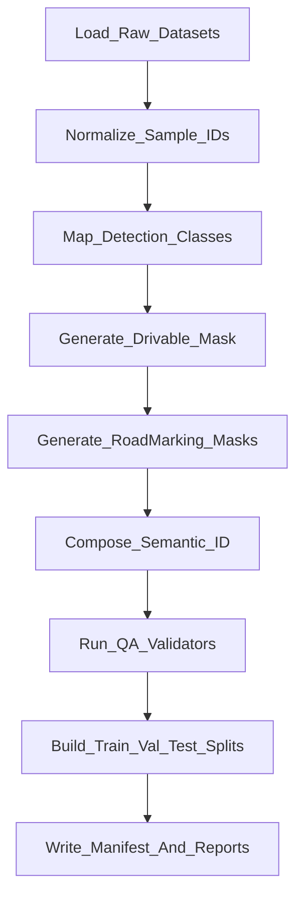

# YOLO PV26 Dataset Conversion Specification

- Spec version: `v1.5`
- Date: `2026-03-05`
- Related doc: `docs/PV26_PRD.md`
- Status: `Implementation-ready`

## 1. Purpose

This document defines a decision-complete conversion standard for building the YOLO PV26 training dataset from heterogeneous sources.

The conversion output must support:
1. Multi-task training (`OD + Drivable Seg + RoadMarking Seg`)
2. Semantic ID generation (`mono8`, classmap-versioned IDs)
3. Reproducible dataset builds with strict validation gates
4. Partial-label-safe training through `ignore(255)` and `has_*` flags

## 2. Scope

### 2.1 In Scope

1. Raw dataset ingestion and normalization
2. Class mapping to PV26 canonical IDs
3. Label export to YOLO-compatible detection and PNG masks
4. Split generation (`train/val/test`) with leakage prevention
5. Validation and conversion reporting

### 2.2 Out of Scope

1. Model training logic
2. Online augmentation policy during training
3. LiDAR projection/backprojection package internals

### 2.3 Competition Domain Constraints (MVP)

1. MVP target domain is simulator-like competition tracks, not public roads.
2. Weather condition for MVP is fixed to `dry`.
3. Time-of-day condition for MVP is fixed to `day`.
4. `night` and `rain` samples are excluded from MVP train/val/test by default.
5. `tunnel` scenes are explicitly in-scope and must be represented in validation data.

## 3. Canonical Output Contract

## 3.1 Output Root

Default output root:
`datasets/pv26_v1`

## 3.2 Directory Layout

```text
datasets/pv26_v1/
  images/
    train/
    val/
    test/
  labels_det/
    train/
    val/
    test/
  labels_seg_da/
    train/
    val/
    test/
  labels_seg_rm_lane_marker/
    train/
    val/
    test/
  labels_seg_rm_lane_subclass/
    train/
    val/
    test/
  labels_seg_rm_road_marker_non_lane/
    train/
    val/
    test/
  labels_seg_rm_stop_line/
    train/
    val/
    test/
  labels_semantic_id/
    train/
    val/
    test/
  meta/
    class_map.yaml
    split_manifest.csv
    conversion_report.json
    source_stats.csv
    checksums.sha256
```

## 3.3 Sample ID and File Naming

`sample_id` format:
`{source}__{sequence}__{frame}__{camera}`

Examples:
1. `bdd100k__day_city_001__000123__cam0`
2. `cityscapes__frankfurt_000001__000294__cam0`

For each sample:
1. Image: `images/{split}/{sample_id}.jpg`
2. Detection label: `labels_det/{split}/{sample_id}.txt`
3. Drivable mask: `labels_seg_da/{split}/{sample_id}.png`
4. Road-marking masks:
   - `labels_seg_rm_lane_marker/{split}/{sample_id}.png`
   - `labels_seg_rm_lane_subclass/{split}/{sample_id}.png`
   - `labels_seg_rm_road_marker_non_lane/{split}/{sample_id}.png`
   - `labels_seg_rm_stop_line/{split}/{sample_id}.png`
5. Semantic ID mask: `labels_semantic_id/{split}/{sample_id}.png` (required only when `has_semantic_id=1`)

## 3.4 Image Requirements

1. Encoding: `jpg`, 8-bit, 3-channel
2. Color order on disk: standard RGB-encoded image files
3. Resolution policy: keep source resolution in conversion output
4. Runtime model input resize/letterbox is not part of this conversion step
5. Source annotations in `json/polygon/polyline` must be converted offline before training.
6. Canonical training labels are:
   - Detection: `YOLO txt`
   - Segmentation: `uint8 PNG mask`
7. Training loaders must consume only normalized artifacts (`jpg + txt + png`), not raw annotation schemas.

## 3.5 Detection Label Format

YOLO text format per line:
`<class_id> <cx> <cy> <w> <h>`

Rules:
1. `class_id`: integer in `[0, 6]`
2. `cx, cy, w, h`: normalized float in `[0.0, 1.0]`
3. Float precision: 6 decimal places
4. Empty file is allowed when no objects exist
5. `min_box_area_px` is a configurable conversion parameter
6. MVP default is `min_box_area_px=0` (no box drop by size)
7. Small-object-critical classes (`traffic_cone`, `traffic_light`, `sign_pole`) must never be dropped by area threshold
8. Boxes clipped to image bounds before normalization

## 3.6 Segmentation Mask Format

All mask files are `uint8 PNG`.

1. `labels_seg_da`: binary + ignore mask (`0=background`, `1=drivable`, `255=ignore`)
2. `labels_seg_rm_lane_marker`: binary + ignore mask (`0=background`, `1=lane_marker`, `255=ignore`)
3. `labels_seg_rm_road_marker_non_lane`: binary + ignore mask (`0=background`, `1=road_marker_non_lane`, `255=ignore`)
4. `labels_seg_rm_stop_line`: binary + ignore mask (`0=background`, `1=stop_line`, `255=ignore`)
5. `labels_seg_rm_lane_subclass`: mono8 + ignore mask
   - `0=background`
   - `1=white_solid`
   - `2=white_dashed`
   - `3=yellow_solid`
   - `4=yellow_dashed`
   - `255=ignore`
6. `labels_semantic_id`: single-channel semantic mask (`uint8`, `255` forbidden)
   - class IDs are defined by `meta/class_map.yaml` and `classmap_version`

Critical rule:
1. Missing supervision must never be encoded as `0`.
2. When a task label is unavailable, fill that task mask with `255` and set `has_*` flag to `0` in manifest.

Semantic composition order:
1. Initialize all pixels to `0`
2. Set drivable pixels to `1`
3. Overwrite road-marking pixels by priority (example):
   - `stop_line` > `lane_subclass` > `road_marker_non_lane` > `drivable_area` > `background`
   - `stop_line` may still be a subset of `road_marker_non_lane` in binary RM channels; semantic ID uses a single chosen class per pixel

Notes:
1. `labels_semantic_id` is required only when `has_semantic_id=1`.
2. `labels_semantic_id` must not contain `255`.

## 3.7 Split Manifest Schema

`meta/split_manifest.csv` columns:
1. `sample_id`
2. `split` (`train|val|test`)
3. `source`
4. `sequence`
5. `frame`
6. `camera_id`
7. `timestamp_ns`
8. `has_det` (`0|1`)
9. `has_da` (`0|1`)
10. `has_rm_lane_marker` (`0|1`)
11. `has_rm_road_marker_non_lane` (`0|1`)
12. `has_rm_stop_line` (`0|1`)
13. `has_rm_lane_subclass` (`0|1`)
14. `has_semantic_id` (`0|1`)
15. `det_label_scope` (`full|subset|none`)
16. `det_annotated_class_ids` (comma-separated canonical det IDs; empty when `full` or `none`)
17. `image_relpath`
18. `det_relpath`
19. `da_relpath`
20. `rm_lane_marker_relpath`
21. `rm_road_marker_non_lane_relpath`
22. `rm_stop_line_relpath`
23. `rm_lane_subclass_relpath`
24. `semantic_relpath` (nullable when `has_semantic_id=0`)
25. `width`
26. `height`
27. `weather_tag` (`dry|rain|snow|unknown`)
28. `time_tag` (`day|night|dawn_dusk|unknown`)
29. `scene_tag` (`open|tunnel|shadow|unknown`)
30. `source_group_key`

Active policy note:
1. New coarse-7class converters should prefer `det_label_scope=full` or `none`.
2. `subset` remains only for backward compatibility or truly partial legacy sources.

## 3.8 RoadMarking Label Normalization Policy

1. Road-marking source format must be declared per dataset/sample as one of:
   - `pixel_mask`
   - `polyline`
   - `dual_boundary`
2. If road-marking source is `pixel_mask`:
   - additional rasterization is forbidden
   - keep original geometry
   - apply only class remap and ignore mapping
3. If road-marking source is `polyline` or `dual_boundary`:
   - convert to centerline first
   - rasterize with nearest-neighbor drawing (no anti-aliasing)
   - use default thickness: train `8px`, eval `2px`
4. Missing road-marking supervision must be encoded as all-`255` with `has_rm_*=0` per channel.
5. Road-marking evaluation must use the same normalization route as GT generation:
   - `pixel_mask` route for mask-native labels
   - `2px` route for vector-native labels

## 4. Canonical Class IDs

## 4.1 Detection Classes

| det_id | class_name |
|---|---|
| 0 | vehicle |
| 1 | bike |
| 2 | pedestrian |
| 3 | traffic_cone |
| 4 | obstacle |
| 5 | traffic_light |
| 6 | sign_pole |

## 4.2 Segmentation Classes

This table describes the current `classmap-v3` semantic ID contract. New semantic IDs must be introduced via a new `classmap-vX` and `meta/class_map.yaml`.

| seg_id | class_name |
|---|---|
| 0 | background |
| 1 | drivable_area |
| 2 | lane_white_solid |
| 3 | lane_white_dashed |
| 4 | lane_yellow_solid |
| 5 | lane_yellow_dashed |
| 6 | road_marker_non_lane |
| 7 | stop_line |

## 5. Source Dataset Adapter Rules

Each source dataset must be converted using a dedicated adapter with deterministic mapping.

## 5.1 BDD100K Adapter

Inputs:
1. Object detection annotations
2. Drivable area annotations
3. Road marking annotations (lane markers and other road markers when available)

Mapping:
1. `car|bus|truck|other vehicle -> vehicle`
2. `motorcycle|bicycle|bike -> bike`
3. `person|pedestrian|rider -> pedestrian`
4. `traffic light|light -> traffic_light`
5. `traffic sign|pole|pole-like roadside fixture|sign -> sign_pole`
6. `traffic cone|construction cone|cone -> traffic_cone`
7. `barrier|bollard|train|road obstacle -> obstacle`

Segmentation:
1. Drivable labels (`direct`, `alternative`) -> `drivable=1`
2. Lane-marker-equivalent categories -> `rm_lane_marker=1`
3. Non-lane road-marking categories -> `rm_road_marker_non_lane=1`
4. Stop line (if explicitly available) -> `rm_stop_line=1` and also `rm_road_marker_non_lane=1`
5. Road-marking mask generation must follow Section `3.8 RoadMarking Label Normalization Policy` (mask pass-through for mask-native sources, rasterization only for vector-native sources).

## 5.2 Cityscapes Adapter

Inputs:
1. Fine/coarse semantic labels
2. Instance annotations (when available)

Mapping:
1. `person -> pedestrian`
2. `rider -> pedestrian`
3. `car|truck|bus -> vehicle`
4. `motorcycle|bicycle -> bike`
5. `traffic light -> traffic_light` when explicit external OD source is available
6. `traffic sign|pole -> sign_pole` when explicit external OD source is available
7. `train -> obstacle`
8. Set `det_label_scope=subset` and record actual annotated canonical det IDs in `det_annotated_class_ids`.

Segmentation:
1. `road` and `parking` -> `drivable=1`
2. Road-marking supervision is unavailable by default in Cityscapes conversion.
3. Default Cityscapes road-marking policy for MVP:
   - `labels_seg_rm_*` are filled with `255`
   - `has_rm_*=0`
4. If an explicit external road-marking annotation source is provided, set `has_rm_*=1` per available channel and export valid masks.

## 5.3 KITTI-360 Adapter

Inputs:
1. 2D/3D semantic and instance annotations

Mapping policy:
1. Apply Cityscapes-equivalent coarse mapping where labels overlap
2. Vehicle/person/cycle classes map to `vehicle|pedestrian|bike`
3. Static unknown obstacles map to `obstacle` only if confidently labeled
4. Set `det_label_scope=subset` and fill `det_annotated_class_ids` based on available labels.

Segmentation:
1. `road` and `parking` -> `drivable=1`
2. Lane/road-marking classes -> `rm_lane_marker=1` or `rm_road_marker_non_lane=1` when explicitly available (dataset profile decides mapping)

## 5.4 Waymo Adapter

Inputs:
1. Camera labels for detection
2. Panoptic/semantic labels when available

Detection mapping:
1. Active 7-class export is segmentation-backed only.
2. `TYPE_CAR|TYPE_TRUCK|TYPE_BUS|TYPE_OTHER_LARGE_VEHICLE|TYPE_TRAILER -> vehicle`
3. `TYPE_BICYCLE|TYPE_MOTORCYCLE|TYPE_CYCLIST|TYPE_MOTORCYCLIST -> bike`
4. `TYPE_PEDESTRIAN -> pedestrian`
5. `TYPE_CONSTRUCTION_CONE_POLE -> traffic_cone`
6. `TYPE_PEDESTRIAN_OBJECT -> obstacle`
7. `TYPE_TRAFFIC_LIGHT -> traffic_light`
8. `TYPE_SIGN|TYPE_POLE -> sign_pole`
9. Rows without `camera_segmentation` are skipped for OD export instead of falling back to coarse `camera_box` subset labels.
10. Active generated WOD rows use `det_label_scope=full`.

Segmentation:
1. Road surface classes -> `drivable=1`
2. Lane marker classes -> `rm_lane_marker=1` when available
3. Road marker classes -> `rm_road_marker_non_lane=1` when available
4. Stop line is not a dedicated Waymo camera segmentation class; default policy is `rm_stop_line` all `255` with `has_rm_stop_line=0`
5. Missing road-marking annotation -> road-marking masks are all `255` with `has_rm_*=0`
6. Missing drivable annotation -> drivable mask is all `255` and `has_da=0`

## 5.5 RLMD Adapter

Inputs:
1. Road marking segmentation labels

MVP default policy:
1. RLMD samples are excluded from `pv26_v1` training build by default.
2. Reason: RLMD categories include many non-lane road markings; direct merge causes lane false positives.

If RLMD is explicitly enabled (experimental):
1. Only lane-boundary-equivalent categories may map to `rm_lane_marker=1`.
2. Non-lane categories should map to `rm_road_marker_non_lane=1` (not dropped).
3. Stop line category maps to `rm_stop_line=1` and also `rm_road_marker_non_lane=1`.
4. Drivable mask must be all `255` with `has_da=0` unless another trusted source provides drivable labels.
5. Detection label file is empty with `has_det=0` for RLMD-only samples.
6. `has_rm_lane_marker=1` is allowed only when lane-boundary mapping table is versioned and documented.

## 5.6 Self-Collected Adapter

Mandatory annotation targets:
1. Detection classes `0..10`
2. Drivable binary mask
3. Road-marking multi-channel masks (`rm_lane_marker`, `rm_road_marker_non_lane`, `rm_stop_line`)

Rules:
1. Annotation guide must follow `class_map.yaml` exactly
2. Any unlabeled hazardous object in ROI invalidates sample QA
3. For MVP, `weather_tag=dry` and `time_tag=day` must be set.
4. Tunnel frames must be tagged with `scene_tag=tunnel`.

## 6. Conversion Pipeline



Step definitions:
1. Load raw files and metadata from source adapters
2. Convert raw annotation schemas (`json/polygon/polyline`) into canonical label artifacts (`YOLO txt`, `PNG masks`)
3. Generate canonical `sample_id` and file names
4. Convert and clamp detection boxes with `min_box_area_px` policy
5. Populate detection coverage metadata (`det_label_scope`, `det_annotated_class_ids`)
6. Convert drivable and road-marking masks with `ignore(255)` and `has_*` flags
7. Normalize road-marking labels using Section `3.8` policy (mask pass-through or vector rasterization)
8. Compose semantic ID mask (classmap-defined IDs) only for samples with valid semantic export (`has_semantic_id=1`)
9. Run QA validators (hard fail + warnings)
10. Build leakage-safe splits
11. Write outputs and reports

## 7. Split Policy

1. Default ratio: `train=0.8`, `val=0.1`, `test=0.1`
2. Split grouping key: `{source, sequence}` (camera_id excluded)
3. Frames from the same grouped sequence must not appear in different splits
4. Paired multi-camera frames from one sequence must always share the same split
5. Source-specific sequence key rules:
   - `BDD100K`: video id
   - `Cityscapes`: city id
   - `KITTI-360`: drive sequence id (non-overlap rule)
   - `Waymo`: segment id
   - `self-collected`: run/session id
6. At least `5%` of each source must exist in `val` when source size permits
7. Rare class retention:
   - If a class has `< 200` samples, allocate at least `20` to `val+test` combined
8. MVP domain filter:
   - include only `weather_tag=dry`
   - include only `time_tag=day`
   - exclude `rain` and `night` samples by default
9. Tunnel stratification:
   - if `scene_tag=tunnel` samples exist, reserve at least `10%` of them for `val+test`
   - both `val` and `test` should contain tunnel samples when available

## 8. Validation Rules

## 8.1 Hard Fail Rules

1. Missing image file
2. Missing required label file according to `has_*` flags
3. Invalid class ID outside allowed range
4. YOLO bbox values outside `[0,1]` after normalization
5. Mask datatype not `uint8`
6. `labels_seg_da` contains values outside `{0,1,255}`
7. Any `labels_seg_rm_*` contains values outside `{0,1,255}`
8. `has_da=0` but `labels_seg_da` contains value other than `255`
9. Any `has_rm_*=0` but the corresponding `labels_seg_rm_*` contains value other than `255`
10. `has_semantic_id=1` and semantic mask contains values outside `class_map.yaml` IDs
11. Dimension mismatch among image/da/road-marking/semantic files
12. Leakage detected: same `{source, sequence}` exists in multiple splits
13. `det_label_scope=subset` but `det_annotated_class_ids` is empty
14. `det_label_scope=none` with non-empty detection label file
15. Detection class IDs outside `det_annotated_class_ids` for subset samples
16. MVP dataset contains samples outside `weather_tag=dry` or `time_tag=day`

## 8.2 Warning Rules

1. Road-marking positive pixel ratio `> 0.35`
2. Drivable positive pixel ratio `< 0.02` for daytime road scenes
3. No detections in more than `95%` of a sequence
4. Severe class imbalance (`max_class_count / min_nonzero_class_count > 100`)
5. Tunnel samples exist but are missing in `val` or `test`

## 8.3 QA Exit Criteria

1. Hard fail count must be `0`
2. Warning count must be reviewed and signed off in `conversion_report.json`

## 9. Reproducibility and Versioning

1. Every conversion run writes `meta/conversion_report.json` including:
   - converter name + version
   - spec reference (this document)
   - timestamp (UTC)
   - run id (if provided)
   - conversion config summary (paths + key options)
2. Recommended (optional) fields for stronger reproducibility:
   - git commit hash
   - config hash
3. `checksums.sha256` includes all exported images and labels
4. Any mapping change requires:
   - class map version bump
   - full dataset rebuild
   - new output root name (example: `pv26_v2`)

## 10. Entry Points (Current) and Adapter Checklist

This repo currently uses dataset-specific converter scripts (adapters).

### 10.1 BDD100K (implemented)

Convert:
```bash
python tools/data_analysis/bdd/convert_bdd_type_a.py \
  --images-root <BDD_IMAGES_DIR> \
  --labels <BDD_LABELS_DIR_OR_JSON> \
  --drivable-root <BDD_DRIVABLE_MASK_DIR> \
  --out-root <OUT_ROOT> \
  --splits train,val
```

Interactive runner (convert → validate → QC → debug optional):
```bash
python tools/data_analysis/bdd/run_bdd100k_normalize_interactive.py --bdd-root <BDD100K_ROOT>
```

Validate:
```bash
python tools/data_analysis/bdd/validate_pv26_dataset.py --out-root <OUT_ROOT>
```

QC report:
```bash
python tools/data_analysis/bdd/pv26_qc_report.py --dataset-root <OUT_ROOT> --out-json <OUT_ROOT>/meta/qc_report.json
```

### 10.2 Adding a new dataset adapter (ETRI/RLMD/WOD/…)

When implementing `tools/data_analysis/<dataset>/convert_<dataset>_type_a.py`, enforce:
1. Output directory layout matches Section 3.2.
2. `meta/split_manifest.csv` is the source-of-truth for loaders and validators.
3. Partial-label policy is strict:
   - missing supervision is exported as all-`255` mask
   - corresponding `has_*` flag is `0`
   - never fill missing labels with background(`0`)
4. Detection labels follow Section 3.5 and respect `det_label_scope` semantics.
5. Segmentation masks follow Section 3.6 value domains.
6. Write:
   - `meta/conversion_report.json`
   - `meta/checksums.sha256`

### 10.3 Target unified CLI (future)

If we later add a unified CLI, it must be a thin wrapper over adapters, not a second conversion path.

```bash
python tools/convert_dataset.py <audit|convert|validate> --config <pv26.yaml> ...
```

## 11. Acceptance Checklist

1. Output tree matches Section 3.2 exactly
2. All labels satisfy class and format constraints
3. Split manifest is complete and leak-free
4. Semantic ID mask contract (`meta/class_map.yaml` IDs, `255` forbidden) is fully respected for `has_semantic_id=1` samples
5. Conversion report and checksums are generated
6. `ignore(255)` and `has_*` contract is fully respected
7. MVP dataset domain is constrained to `dry + day` and includes tunnel validation samples when available
8. Dataset is ready for YOLO PV26 training without manual edits
